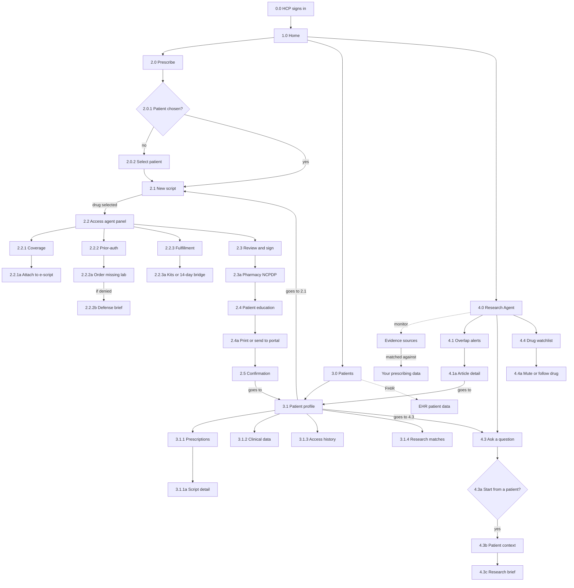

# ScriptAssist sitemap

Source of truth for information architecture. Taken from Figma **Sitemap v2 · App structure** and **Navigation overview** on the [Sitemap page](https://www.figma.com/design/30UmgzW8mO4uZwjRC3e2X1/ScriptAssist?node-id=2-3).

Use the IDs below when naming screens, routes, and tasks. Do not invent pages that are not on this map.

## How to read it

Home (`1.0`) opens three top-level pages. A global top nav is on every screen: **Prescribe · Patients · Research Agent**. The logo is the Home link. Cross-links carry context (a patient pre-filled in Prescribe, a patient pre-loaded in Research).

| Type | Meaning |
|---|---|
| Entry | How a session starts |
| Page | A screen |
| Tab | A section inside the parent page |
| Decision | A branch |
| Modal | Overlay; not a route |
| Action | A control on the current screen; not a route |
| External | System outside ScriptAssist |
| Goes to | Cross-link to another ID. Not a new page |

When the navigation overview and the structure map disagree on a target, follow the structure map. The overview points at the top-level page (`2.0`, `3.0`, `4.0`). The structure map points at the landing node (`2.1`, `3.1`, `4.3`).

## Map

## 0 · Entry

| ID | Type | Name | Notes |
|---|---|---|---|
| 0.0 | Entry | HCP signs in | SSO via EHR or clinic account. Lands on Home. |

## 1 · Home

| ID | Type | Name | Notes |
|---|---|---|---|
| 1.0 | Page | Home | Today: pending PAs, recent scripts, new research alerts. |

Top nav from Home, and from every other screen, reaches Prescribe, Patients, and Research Agent. Logo returns to Home.

## 2 · Prescribe

Pick a patient, search a drug, run access checks, sign, then educate.

| ID | Type | Name | Notes |
|---|---|---|---|
| 2.0 | Page | Prescribe | Pick patient, search drug. |
| 2.0.1 | Decision | Patient chosen? | **No** opens 2.0.2. After a patient is chosen, continue to 2.1. |
| 2.0.2 | Modal | Select patient | Search patients or start new. |
| 2.1 | Page | New script | Drug, dose, SIG, pharmacy. Continues when a drug is selected. |
| 2.2 | Page | Access agent panel | Runs coverage, prior-auth, and fulfillment checks. |
| 2.2.1 | Tab | Coverage | Tier, cost, co-pay card. |
| 2.2.1a | Action | Attach to e-script | Adds secondary billing. |
| 2.2.2 | Tab | Prior-auth | Criteria checklist. |
| 2.2.2a | Action | Order missing lab | |
| 2.2.2b | Modal | Defense brief | If denied. Copy or export PDF. |
| 2.2.3 | Tab | Fulfillment | Clinic restock or 14-day bridge. |
| 2.2.3a | Action | Kits or 14-day bridge | Restock or ship home. |
| 2.3 | Page | Review and sign | Summary of coverage, PA, and fulfillment. |
| 2.3a | External | Pharmacy (NCPDP) | E-script transmitted. |
| 2.4 | Page | Patient education | Plain-language handout, schedule, language. |
| 2.4a | Action | Print or send to portal | Clinician approves first. QR links to the digital copy. |
| 2.5 | Page | Confirmation | Script sent, next steps. |
| — | Goes to | Patient profile | Target **3.1**. See this script in history. |

## 3 · Patients

Search the panel, open a profile, then jump back into prescribing or research with that patient loaded.

| ID | Type | Name | Notes |
|---|---|---|---|
| 3.0 | Page | Patients | Search, filter by drug or PA status. |
| — | External | EHR patient data | FHIR. Problems, labs, vitals, meds. Feeds the profile. |
| 3.1 | Page | Patient profile | Opens after selecting a patient. Dx, allergies, active meds summary. |
| 3.1.1 | Tab | Prescriptions | Everything you prescribed, with status. |
| 3.1.1a | Page | Script detail | Coverage, PA, bridge, handout. |
| 3.1.2 | Tab | Clinical data | Labs, vitals, notes, history. |
| 3.1.3 | Tab | Access history | PAs, appeals, bridge shipments. |
| 3.1.4 | Tab | Research matches | New studies tied to this patient's meds. |
| — | Goes to | New prescription | Target **2.1**. Patient pre-filled. |
| — | Goes to | Research this patient | Target **4.3**. Patient context pre-loaded. |

## 4 · Research Agent

A feed of new evidence matched to what this clinician prescribes.

**Overlap** means a new publication mentions a drug, indication, or adverse event tied to active prescriptions.

| ID | Type | Name | Notes |
|---|---|---|---|
| 4.0 | Page | Research Agent | Feed of new evidence matched to your prescribing. |
| — | External | Evidence sources | Monitor. PubMed, journals, FDA labels, ClinicalTrials.gov. |
| — | External | Your prescribing data | From the Patients area (`3.x`). Drugs and patients you treat. Evidence is matched against this. |
| 4.1 | Tab | Overlap alerts | New study affects drugs you prescribe. |
| 4.1a | Page | Article detail | Summary, why it matters, affected patients. |
| — | Goes to | Affected patient | Target **3.1**. Open profile. |
| 4.3 | Tab | Ask a question | Patient-based or standalone. |
| 4.3a | Decision | Start from a patient? | **Yes** loads 4.3b, then 4.3c. Standalone questions stay on this tab; that branch is not a separate node. |
| 4.3b | Page | Patient context | Pulled from the patient record. |
| 4.3c | Page | Research brief | Studies, similar cases, gaps, links. |
| 4.4 | Tab | Drug watchlist | Auto-built from your prescriptions. |
| 4.4a | Action | Mute or follow drug | |

There is no `4.2` on the map.

## Cross-links

These are the only jumps between sections. They must carry the context in the last column.

| From | To | Context |
|---|---|---|
| 2.5 Confirmation | 3.1 Patient profile | This script appears in history |
| 3.1 Patient profile | 2.1 New script | Patient pre-filled |
| 3.1 Patient profile | 4.3 Ask a question | Patient context pre-loaded |
| 4.1a Article detail | 3.1 Patient profile | Open the affected patient |

The navigation overview states the same relationships at page level: Prescribe → patient profile, Patients → new prescription and research this patient, Research Agent → affected patient.

## Code today

The running app is one route, `/`, and does not match this map yet. Treat the table above as the target.

| Sitemap | What exists now |
|---|---|
| 0.0 HCP signs in | `ClinicianLogin` on `/` |
| 1.0 Home | Not built. Closest surface is the patient queue |
| 2.0–2.5 Prescribe | Queue opens a combined chart: `EHRLayout` plus `ScriptAssistDock` (coverage, prior-auth, fulfillment, handout). Not split into these screens |
| 3.0–3.1 Patients | Queue lists patients. No profile or profile tabs |
| 4.0–4.4 Research Agent | Not built |
